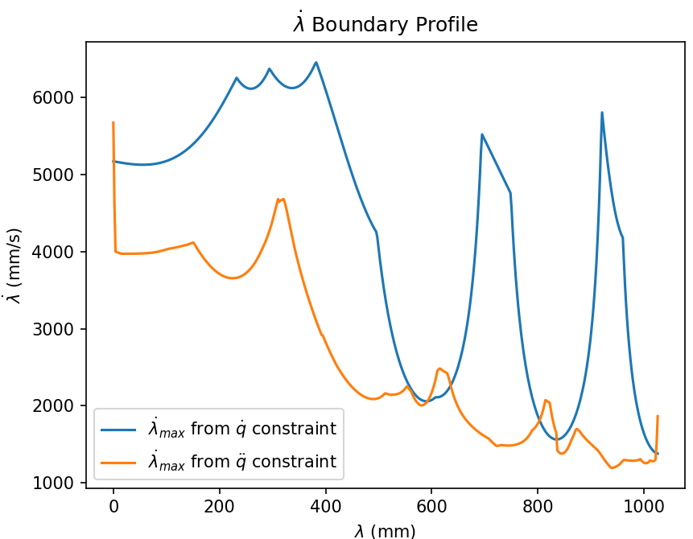

# $\lambda$ Parametrization of 3D Spatial Curve

Functions to calculate $\lambda$ given Cartesian/JS curve. Also include function to estimated maximum traversal speed $\dot{\lambda}$ from joint velocity and acceleration limit.

